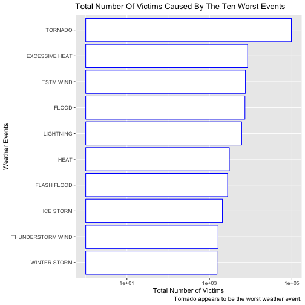
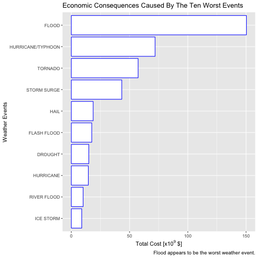

# Reproducible Research: Course Project
## Consequences Of Weather Events On People Health And Economy


Author: Marion Grould

Date: 7 December, 2017

### Synopsis

Storms and other severe weather events can cause both public health and economic problems for communities and municipalities. Many severe events can result in fatalities, injuries, and property damage, and preventing such outcomes to the extent possible is a key concern. This project involves exploring the U.S. National Oceanic and Atmospheric Administration's (NOAA) storm database. This database tracks characteristics of major storms and weather events in the United States, including when and where they occur, as well as estimates of any fatalities, injuries, and property damage. The aim of this study is to report the ten weather events that caused the worst people health or economic damages between 1950 and 2001.

## Data Processing

In this section we load and tranform the data from the NOAA database into a tidy data set useful for the study. 

#### Load Different R Modules


```r
library(R.utils)
library(dplyr)
library(ggplot2)
library(knitr)
```

#### Download, Unzip And Read The Data 

We first download the data set from the web, unzip and store the data in the variable **DataStorm0**.


```r
fileUrl <- "https://d396qusza40orc.cloudfront.net/repdata%2Fdata%2FStormData.csv.bz2"
download.file(fileUrl, destfile = "repdata%2Fdata%2FStormData.csv.bz2", method = "curl")
bunzip2("repdata%2Fdata%2FStormData.csv.bz2", "repdata%2Fdata%2FStormData.csv", 
        remove = FALSE, skip = TRUE)
```

```
## [1] "repdata%2Fdata%2FStormData.csv"
## attr(,"temporary")
## [1] FALSE
```

```r
dataStorm0 <- read.csv("repdata%2Fdata%2FStormData.csv", 
                       header = TRUE, na.strings=c("", "NA"))
```

#### Select The Columns

Here, we select the columns useful to perform the study and define the new variable **dataStorm**. The total number of columns is 37, however we only consider the date of the event (BGN_DATE), the state where the event took place (STATE), the type of the event (EVTYPE), the number of victims due to the event (FATALITIES, INJURIES) and the cost of damage caused by the event (PROPDMG, PROPDMGEXP, CROPDMG, CROPDMGEXP). We mention that the PROPDMGEXP and CROPDMGEXP variables contain letters indicating whether PROPDMG and CROPDMG are in hundreds (H, h), thousands (K, k), millions (M, m) or billions (B, b), respectively.


```r
dataStorm <- dataStorm0 %>%
    select(BGN_DATE, STATE, EVTYPE, FATALITIES:CROPDMGEXP) %>%
    as.data.frame()
names(dataStorm)
```

```
## [1] "BGN_DATE"   "STATE"      "EVTYPE"     "FATALITIES" "INJURIES"  
## [6] "PROPDMG"    "PROPDMGEXP" "CROPDMG"    "CROPDMGEXP"
```

#### Clean The Data Set

We convert the date into a Date format.


```r
dataStorm$BGN_DATE <- as.Date(dataStorm$BGN_DATE, "%m/%d/%Y")
```

We clean the PROPDMGEXP and CROPDMGEXP variables: 

- we convert the tiny letters to capital,

- we set the missing values to 0.

The majority of the missing values in PROPDMGEXP and CROPDMGEXP correspond to zero values in PROPDMG and CROPDMG, respectively. Thus, the "real" missing values in PROPDMGEXP and CROPDMGEXP are those where PROPDMG and CROPDMG are different to zero. The percentage of "real" missing values is less than 1% for both PROPDMG and CROPDMG. The missing information in the data set is thus negligible and will not bias the future results. 


```r
NAFunc <- function(x){
    NAInd <- which(x != "B" & x != "H" & x != "K" & x != "M")
    x[NAInd] <- NA
    x[is.na(x)] <- 0
    return(x)
}
dataStorm$PROPDMGEXP <- NAFunc(toupper(dataStorm$PROPDMGEXP))
dataStorm$CROPDMGEXP <- NAFunc(toupper(dataStorm$CROPDMGEXP))
```

We convert the PROPDMGEXP and CROPDMGEXP variables into numbers.


```r
Let2Num <- function(x){
    x <- gsub("H", 1e2, x)
    x <- gsub("K", 1e3, x)
    x <- gsub("M", 1e6, x)
    x <- gsub("B", 1e9, x)
    x <- as.numeric(x)
    return(x)
}
dataStorm$PROPDMGEXP <- Let2Num(dataStorm$PROPDMGEXP)
dataStorm$CROPDMGEXP <- Let2Num(dataStorm$CROPDMGEXP)
```

#### Reshape The Data Set

We multiply the __DMGEXP variable by the __DMG variable and remove the __DMGEXP variable. The new data set generated is stored in **dataStorm2.0**


```r
dataStorm2.0 <- dataStorm %>%
    mutate(PROPDMG = PROPDMG*PROPDMGEXP) %>%
    mutate(CROPDMG = CROPDMG*CROPDMGEXP) %>%
    select(-PROPDMGEXP,-CROPDMGEXP) %>%
    as.data.frame()
```

We compute the total health and cost damages caused by the various weather events and rename the variables.


```r
dataStorm2.0 <- cbind(dataStorm2.0, dataStorm2.0$FATALITIES+dataStorm2.0$INJURIES) 
dataStorm2.0 <- cbind(dataStorm2.0, dataStorm2.0$PROPDMG+dataStorm2.0$CROPDMG) 
names(dataStorm2.0) <- c("date", "state", "event.type", "fatality", "injury", 
                         "property.damage", "crop.damage", 
                         "total.health.damage", "total.cost.damage")
```

The tidy final data set is now ready.


```r
kable(head(dataStorm2.0))
```


|date       |state |event.type | fatality| injury| property.damage| crop.damage| total.health.damage| total.cost.damage|
|:----------|:-----|:----------|--------:|------:|---------------:|-----------:|-------------------:|-----------------:|
|1950-04-18 |AL    |TORNADO    |        0|     15|           25000|           0|                  15|             25000|
|1950-04-18 |AL    |TORNADO    |        0|      0|            2500|           0|                   0|              2500|
|1951-02-20 |AL    |TORNADO    |        0|      2|           25000|           0|                   2|             25000|
|1951-06-08 |AL    |TORNADO    |        0|      2|            2500|           0|                   2|              2500|
|1951-11-15 |AL    |TORNADO    |        0|      2|            2500|           0|                   2|              2500|
|1951-11-15 |AL    |TORNADO    |        0|      6|            2500|           0|                   6|              2500|

### Results

In this section we give the ten weather events that caused the worst health and cost damages in the US.

#### Harmful Weather Events In The US

We compute the total health damage caused by each type of events and select the ten worst weather events.


```r
HarmfulEvents <- dataStorm2.0 %>%
    group_by(event.type) %>%
    summarize(total.health.damage.by.event = sum(total.health.damage)) %>%
    arrange(desc(total.health.damage.by.event)) %>% 
    head(n = 10) %>%
    as.data.frame()
```

We plot the results.


```r
ggplot(data=HarmfulEvents, aes(x=reorder(event.type, total.health.damage.by.event), 
                               y=total.health.damage.by.event)) +
    geom_bar(stat="identity", color="blue", fill="white") +
    xlab("Weather Events") + ylab("Total Number of Victims") +
    ggtitle("Total Number Of Victims Caused By The Ten Worst Events") +
    labs(caption = "Tornado appears to be the worst weather event.") +
    coord_flip() + scale_y_log10()
```



We can see that the weather event that caused the worst damage on people is the **tornado** with approximatively **0.1 million of victims**. The three next worst events are **heat, wind and flood**.

#### Cost Of Damage Due To Weather Events In The US

We compute the total cost of damage caused by each type of events and select the ten worst weather events.


```r
ExpensiveEvents <- dataStorm2.0 %>%
    group_by(event.type) %>%
    summarize(total.cost.damage.by.event = sum(total.cost.damage)) %>%
    arrange(desc(total.cost.damage.by.event)) %>% 
    head(n = 10) %>%
    as.data.frame()
```

We plot the results.


```r
ggplot(data=ExpensiveEvents, aes(x=reorder(event.type, total.cost.damage.by.event), 
                               y=total.cost.damage.by.event*1e-9)) +
    geom_bar(stat="identity", color="blue", fill="white") +
    xlab("Weather Events") + ylab(expression("Total Cost [x10"^"9"*" $]")) +
    ggtitle("Economic Consequences Caused By The Ten Worst Events") +
    labs(caption = "Flood appears to be the worst weather event.") +
    coord_flip()
```



We note that the weather event that caused the worst cost of damage in the US is the **flood**. The second worst events are both the **typhoon and hurricane**.
